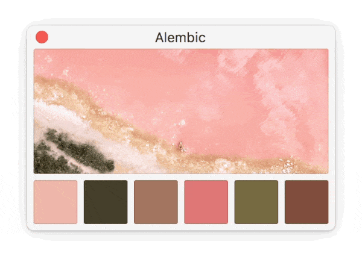
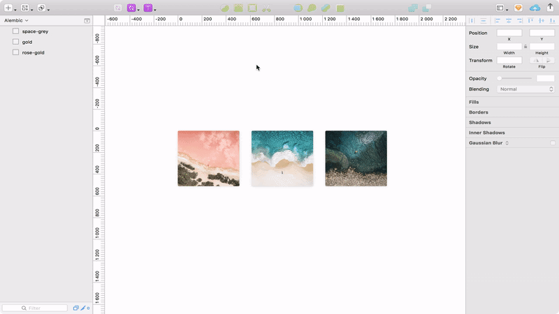
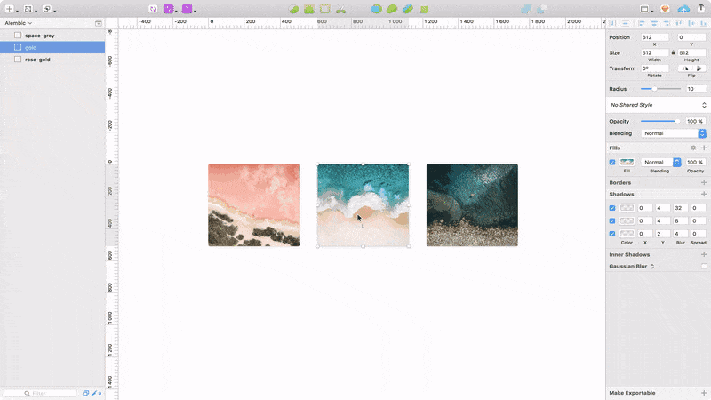
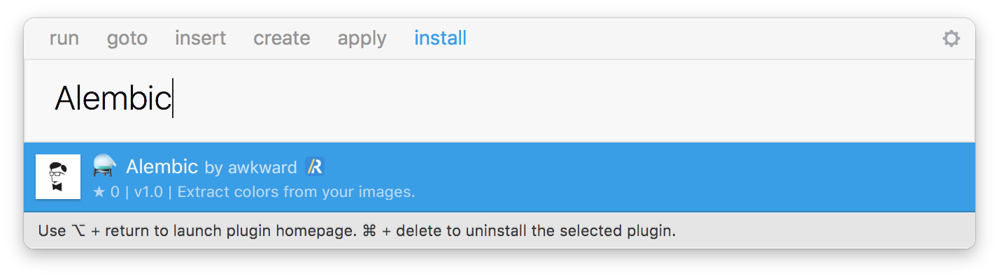

<h1 align="center">
   
  Alembic 
  

    
    
  

</h1>

  

    
    

 
 

A Sketch plugin to extract a color palette from any layer that contains bitmap data. This works for both images and layers with a Pattern fill. Alembic uses [Color Thief](https://github.com/lokesh/color-thief/) to extract a representative color palette.

## Introduction

Hi, we’re [Awkward](https://awkward.co). A while ago, we came across this [Tweet](https://twitter.com/jeffreydgroot/status/889803683927601153) with an idea for a Sketch plugin that extracts color palettes from images. We felt like it was perfect to experiment with and the idea resulted in Alembic.

## Usage

1. Launch `Plugins › ⚗️ Alembic`
2. Select the layer you want to extract the colors from
3. Click a color to copy it to your clipboard

You can also use Sketch Runner to quickly launch Alembic.

## Installation

### Using Sketch Runner

With Sketch Runner, just go to the `install` command and search for `Alembic`.

### Using Sketchpacks

Search for `Alembic` in [Sketchpacks](https://sketchpacks.com) or just [install it directly](https://sketchpacks.com/awkward/Alembic/install).

### Manually

1. Download the [latest release](https://github.com/awkward/Alembic/releases/download/v1.1/alembic.sketchplugin.zip)
2. Open `Alembic.sketchplugin`

## License

> Alembic is available under the MIT license. See the LICENSE file for more info.
